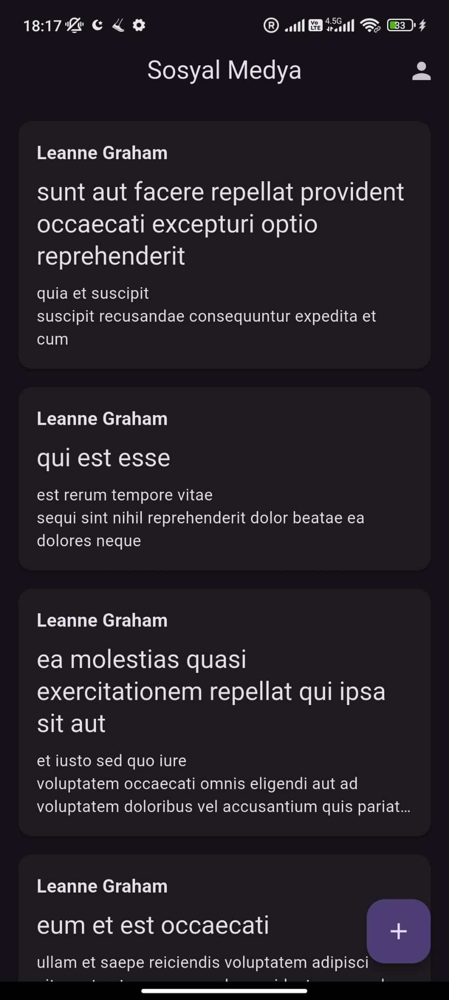
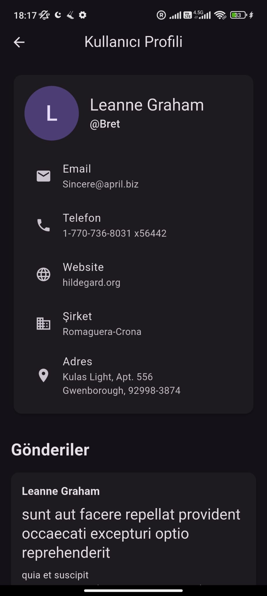
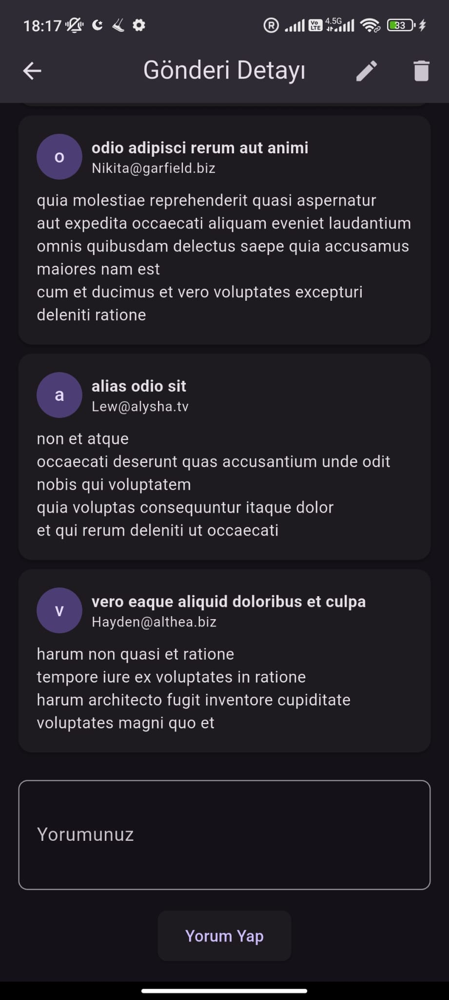

# case_tasks

Modern Flutter ile geliştirilen, JSONPlaceholder API'sini kullanan sosyal medya uygulaması.

---

## Kurulum Talimatları

1. **Projeyi Klonla:**
   ```sh
   git clone https://github.com/aliasafgunsar/socialMediaApp.git
   cd case_tasks
   ```

2. **Gerekli Paketleri Kur:**
   ```sh
   flutter pub get
   ```

3. **Kod Üretimi (Freezed/JsonSerializable için):**
   ```sh
   flutter pub run build_runner build --delete-conflicting-outputs
   ```

4. **Projeyi Çalıştır:**
   ```sh
   flutter run
   ```
   > Android/iOS/Windows/Mac/Linux/Web platformlarında çalışır.

---

## Proje Mimarisi

Proje, sade ve anlaşılır bir klasör yapısına sahiptir:

```
lib/
  models/         # Tüm veri modelleri (Post, User, Comment)
  pages/          # Tüm sayfalar (Home, PostDetail, UserList, UserProfile, vs.)
  widgets/        # Tekrar kullanılabilir widgetlar (PostCard, CommentList, vs.)
  services/       # API servisleri ve repositoryler
  repositories/   # Repository interface ve implementasyonları
  providers/      # Riverpod providerları
  route/          # Uygulama router'ı (go_router)
  main.dart       # Giriş noktası
```
```
lib/
├── main.dart                   # Giriş noktası
├── models/                    # Veri modelleri
│   ├── post.dart
│   ├── user.dart
│   └── comment.dart
├── pages/                     # Sayfa yapıları
│   ├── home_page.dart
│   ├── post_detail_page.dart
│   ├── user_list_page.dart
│   └── user_profile_page.dart
├── widgets/                   # Tekrar kullanılabilir widgetlar
│   ├── post_card.dart
│   └── comment_list.dart
├── services/                  # API servisleri
│   └── api_service.dart
├── repositories/             # Repository interface ve implementasyonları
│   ├── post_repository.dart
│   └── user_repository.dart
├── providers/                # Riverpod provider dosyaları
│   ├── post_provider.dart
│   └── user_provider.dart
└── route/                    # Sayfa yönlendirme (go_router)
└── app_router.dart
```

### Katmanlar

- **models/**: Freezed ve JsonSerializable ile oluşturulan veri modelleri.
- **pages/**: Uygulamanın tüm ekranları.
- **widgets/**: Sayfalarda kullanılan tekrar kullanılabilir widgetlar.
- **services/**: API işlemleri ve servis katmanı.
- **repositories/**: Repository pattern ile veri yönetimi.
- **providers/**: Riverpod ile state management.
- **route/**: go_router ile sayfa yönlendirme.

---

## Kullanılan Teknolojiler

- **Flutter** (3.8+)
- **Dio** (HTTP istekleri için)
- **Riverpod** (State management)
- **GoRouter** (Sayfa yönlendirme)
- **Freezed & JsonSerializable** (Model ve veri serileştirme)
- **Material 3 Theme**
- **JSONPlaceholder API** (https://jsonplaceholder.typicode.com)

### pubspec.yaml'dan başlıca paketler:
- `flutter_riverpod`
- `dio`
- `go_router`
- `freezed_annotation`
- `json_annotation`
- `flutter_svg`
- `cached_network_image`
- `intl`
- `flutter_animate`

---

## Proje Özellikleri

- Tüm gönderileri listeleme, detay, kullanıcı profili ve CRUD işlemleri
- Modern ve sade arayüz
- Repository Pattern ve Riverpod ile temiz mimari
- Gerçek API'den veri çekme (JSONPlaceholder)
- Açık/Koyu tema desteği
- Hata ve boş veri yönetimi

---

## Ekranlar

- **Ana Sayfa:** Tüm gönderiler, kullanıcı adı, başlık, özet, detay ve yeni gönderi ekleme
- **Gönderi Detay:** Gönderi içeriği, sahibi, yorumlar, düzenle/sil
- **Kullanıcı Listesi:** Tüm kullanıcılar
- **Kullanıcı Profili:** Kullanıcı bilgileri ve gönderileri
- **Gönderi Formu:** Yeni gönderi ekle/düzenle
-
<p float="left">
  
  
</p>

<p float="left" style="margin-top: 10px;">
  
  
</p>

<p float="left" style="margin-top: 10px;">
  
  
</p>


---

## Notlar

- Uygulama, internet bağlantısı ve JSONPlaceholder API erişimi gerektirir.
- Kodun tamamı sadeleştirilmiş ve okunabilir bir mimariyle yazılmıştır.
- Herhangi bir hata veya geliştirme önerisi için iletişime geçebilirsiniz.

---

## 👨‍💻 Geliştirici

**Ali Asaf Günşar**  
📧 aliasafgunsar@gmail.com  
🌐 [Sitem](https://aliasafgunsar.com)  
🔗 [LinkedIn Profilim](https://linkedin.com/in/aliasafgunsar)
